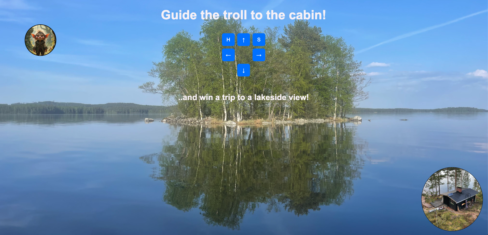

# Guide the Troll to the Cabin

This project is a fun interactive game where the user guides a "troll" to its destination, the cabin. The goal is to use arrow buttons to move the troll (a draggable element) on the screen while enjoying a lakeside-themed interface.

---

## Features

### Interactive Movement
- Use arrow buttons (**↑, ↓, ←, →**) to move the troll across the screen.
- **H** and **S** buttons to hide and show the troll respectively.

### Dynamic Background
- The page features a scenic lake view as the background (`images/IMG_1018.jpeg`).

### Goal Element
- A target circle (`#goal`) representing the cabin, located at the bottom-right corner of the screen.

### Troll Element
- The troll (`#lost`) starts at a specific position and can be moved around using JavaScript.

---

## Structure

### HTML
- A simple layout with:
  - A heading (`h1`) and a subheading (`h3`).
  - The interactive goal and troll elements.
  - Arrow buttons arranged in a grid for movement.

### CSS
- **Styling:**
  - Responsive layout with centered headings and elements.
  - Buttons styled with hover effects.
  - Round shapes for troll (`#lost`) and goal (`#goal`) elements.
- **Positioning:**
  - `#goal`: Fixed at the bottom-right corner.
  - `#lost`: Absolute positioning to allow dynamic movement.

### JavaScript
- **Functions:**
  - `pos(dx, dy)`: Moves the troll based on the input direction.
  - `hideBall()`: Hides the troll.
  - `showBall()`: Shows the troll.

---

## Usage Instructions

### Move the Troll
- Use the arrow buttons to move the troll in different directions.
- The troll moves in steps of `130px`.

### Hide and Show
- Click the **H** button to hide the troll.
- Click the **S** button to show the troll.

### Objective
- Guide the troll to the goal (cabin) in the bottom-right corner.

---

## Image Preview

---

## Watch the Demo on YouTube

[Watch the Gameplay on YouTube](https://www.youtube.com/watch?v=4rISqprQPQc)

---

